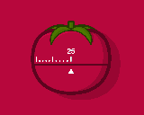
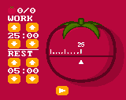

## Tomato Garden - A [Pomodoro time management](https://en.wikipedia.org/wiki/Pomodoro_Technique) application

License: CC-BY

In-browser: on [itch.io](https://tonywang.itch.io/tomato) or [GitHub](https://paladin-t.github.io/pomodoro/html/)

[Download](https://tonywang.itch.io/tomato): for Windows, MacOS, Linux

Ticktock, ticktock...

Don't forget to take a rest after working for a while. Your daily and total tomato harvest are counted respectively on the left top corner.

This program is developed in the fantasy computer [BASIC8](https://store.steampowered.com/app/767240/), it's also available on the [Workshop](https://steamcommunity.com/sharedfiles/filedetails/?id=1527815446). Check out the [homepage](https://paladin-t.github.io/b8/) for more.
